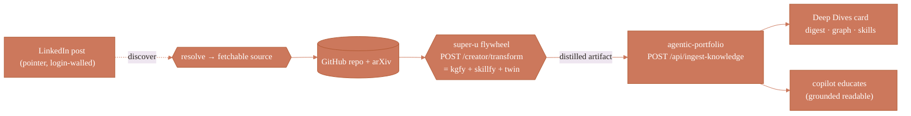

# The "Deepen" pipeline — who owns what, and what connects the pieces

> First-principles memo + the shipped contract. Question it answers: *when you deepen a seminal
> source (a paper/repo you saw on LinkedIn) into a knowledge graph + agent tools, **what part
> should agentic-portfolio play, what should it NOT, and what orchestrates the flying pieces?***

## 1. The flying pieces (worked example: DeepSeek's Engram)

1. **A pointer** — a LinkedIn post (`/feed/update/urn:li:activity:…`). **Login-walled**; 163 KB of OG
   shell, not the real content. It is a *discovery surface*, never a fetch target.
2. **The fetchable source** — the GitHub repo (`deepseek-ai/Engram`, 4.5k★, *"Conditional Memory via
   Scalable Lookup"*) + the arXiv/in-repo PDF. This is what you actually ingest.
3. **super-u `kgfy`** (`POST /knowledgefy`) — source → a **knowledge graph** (`{title, nodes[{id,type,name,summary}],
   edges[{source,target,type}]}`).
4. **super-u `skillfy`** (`POST /skillfy` / `/extract` / `/forge`) — source → **agent skills/tools**, each with
   honest edges (`not_good_at`), an ADEPT explanation, a worksheet, and a discernment check + an
   outcome-feedback loop.
5. **super-u flywheel** (`POST /creator/transform`) — runs one source through **all three layers**
   (Creator · Skillfy · Digital Twin) in a single call.
6. **agentic-portfolio** — this node.

## 2. The law: a node is a sink, not the bus

> **agentic-portfolio is a personal *node* (branding · knowledge · career). super-u is a *capability
> service*. The thing that sequences them is an *orchestrator*. Keep all three separate.**

Collapsing them is the anti-pattern: if the portfolio built the graph and forged the skills, it would
duplicate super-u, couple a public website to heavy ingestion/LLM pipelines, and become a conductor it
has no business being. A node *receives, grounds, presents, and educates* — nothing more.

### What agentic-portfolio should NOT do
- ❌ Build the knowledge graph — that's **kgfy**.
- ❌ Extract or forge the skills/tools — that's **skillfy** (it owns the discernment gate + the outcome loop).
- ❌ Scrape LinkedIn — login-walled; in-browser harvest only ([[zero-trust]]). The JD/source lives on a
  public surface (GitHub/arXiv) you *can* fetch.
- ❌ Be the heavy ingestion/compute pipeline.
- ❌ **Be the orchestrator.** A node is not the bus.

### What agentic-portfolio SHOULD do (its lane)
- ✅ Be the **sink + presenter + grounding layer** — receive the distilled artifact and surface it as a
  **Deep Dives** card: the plain-language digest (*educate me*), a knowledge-map preview, and the extracted
  skills.
- ✅ Own **provenance + honesty** — cite the real source url; a forged skill is shown **unproven** until
  super-u's outcome loop confirms it (the Receipts "verify, don't vibe" ethic). Ungrounded artifacts are
  *rejected* (no source url → 422).
- ✅ Be the **notify + educate surface** — the copilot answers "explain what I learned from Engram" from the
  ingested digest/graph/skills (a grounded readable), never invented.
- ✅ Optionally **register** a *proven* skill as a new copilot action / A2A skill — this is where your agent
  *gains the borrowed capability*.

### What orchestrates (connects the pieces)
**super-u's flywheel (`POST /creator/transform`) is the conductor** — it already runs a source through
kgfy + skillfy + twin. The deepen flow is:



The portfolio exposes **exactly one new surface**: the inbound endpoint the orchestrator calls. That's its
whole rightful slice — small, on-ethic, in-lane.

## 3. The inbound contract (`POST /api/ingest-knowledge`)

Auth: **owner token (`x-portfolio-owner`) OR a pipeline secret (`x-ingest-secret == INGEST_SECRET`)** — so
super-u's flywheel can call it headless, like the Compass cron. It is a **write** surface, hence gated +
rate-limited. `GET` is public (read the feed, for the page or another agent).

Body (mirrors super-u's real output shapes, `@core/deepen-types`):

```jsonc
{
  "source":  { "title": "...", "kind": "repo+paper", "url": "https://github.com/…", "discoveredVia": "https://linkedin.com/…" },
  "digest":  "plain-language 'educate me' summary (from the flywheel's artifact_text)",
  "graph":   { "title": "...", "nodes": [{ "id","type","name","summary" }], "edges": [{ "source","target","type" }], "graphUrl": "https://…full interactive graph" },
  "skills":  [{ "id","name","kind","oneLine","mechanism","characteristicMove","goodAt":[],"notGoodAt":[],"useWhen":[],"verified": false }]
}
```

**Grounding gates (in `normalizeArtifact`, enforced server-side):**
- No `source.title` or no **http(s)** `source.url` → **rejected** (the node refuses ungrounded knowledge).
- Edges to non-existent nodes → **dropped** (not groundable).
- A "skill" with an empty `not_good_at` → **dropped** (a claim with no honest limit is marketing, not a skill).
- `verified` defaults **false** → shown as *unproven*; only super-u's outcome loop flips it true.

Persistence is durable (Postgres KV, shared across instances) merged over the committed Engram seed —
same pattern as the registry.

## 4. Boundaries respected
- No cross-project code: this repo ships only the **node's** slice (the inbound endpoint + Deep Dives
  section + the Engram seed). The kgfy/skillfy/flywheel side lives in **super-u**; this doc describes the
  contract between them.
- The committed `content/deepen.json` is a **seed** (`producedBy: seed-example`), hand-built from the real
  Engram repo/paper as the worked example. Real ingests arrive via the endpoint and win dedup by id.
